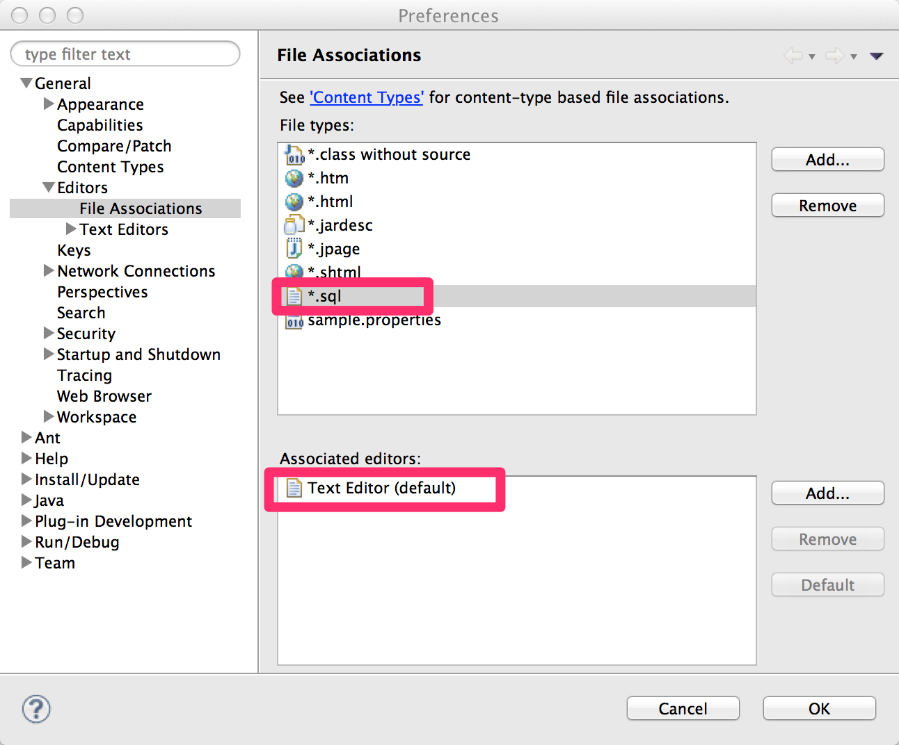
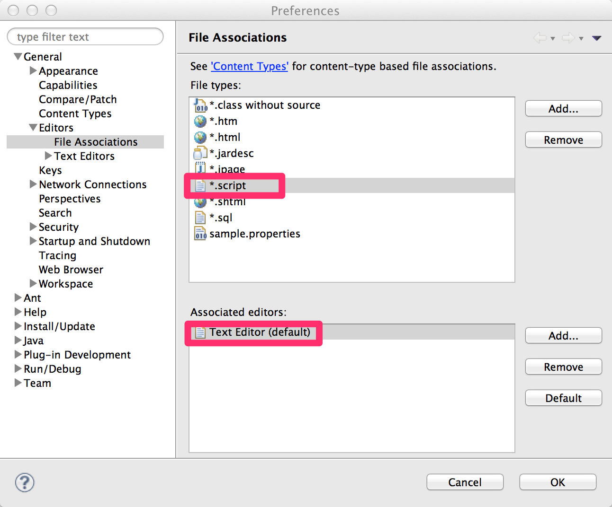

Doma Tools
========================================

Doma Tools is an Eclipse plugin for Doma. 

Doma Tools does the following:

1. cross navigation between Java and SQL files.
2. triggering the annotation processing when saving SQL files.

Marketplace
--------

https://marketplace.eclipse.org/content/doma-tools

Settings
--------

**Depending on the edition of Eclipse you are using, this setting may not be necessary.**

You must open the SQL file in Eclipse to use the Doma tools.
Therefore, it is necessary to set up file associations.

1. Select `Eclipse > Preference…` or `Window > Preference` from menu bar and open preference dialog.
2. Associate `.sql` to `Text Ecitor`.
3. Associate `.script` to `Text Ecitor`.

How to use
-------

### When a Dao interface is opened in the Java Editor or viewed in Outline View

- Select a method, right-click, and select `Doma > Jump to SQL File` to jump to an SQL file. 
  If the file does not exist, a dialog box will open for creating a new file.

### When an SQL file is opened in the Text Editor or viewed in Package Explorer View

- Right-click, and select `Doma > Jump to Dao` to jump to a Dao interface.

License
-------

Apache License, Version 2.0
